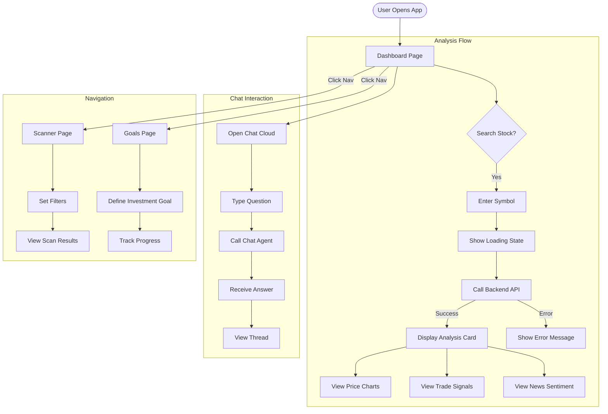
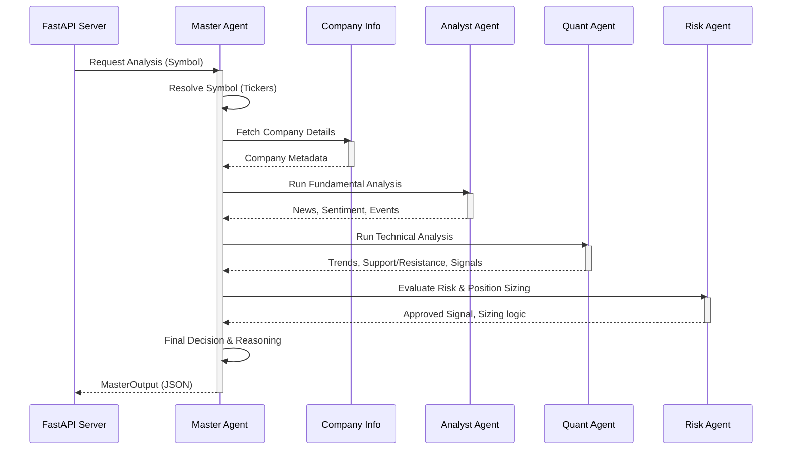
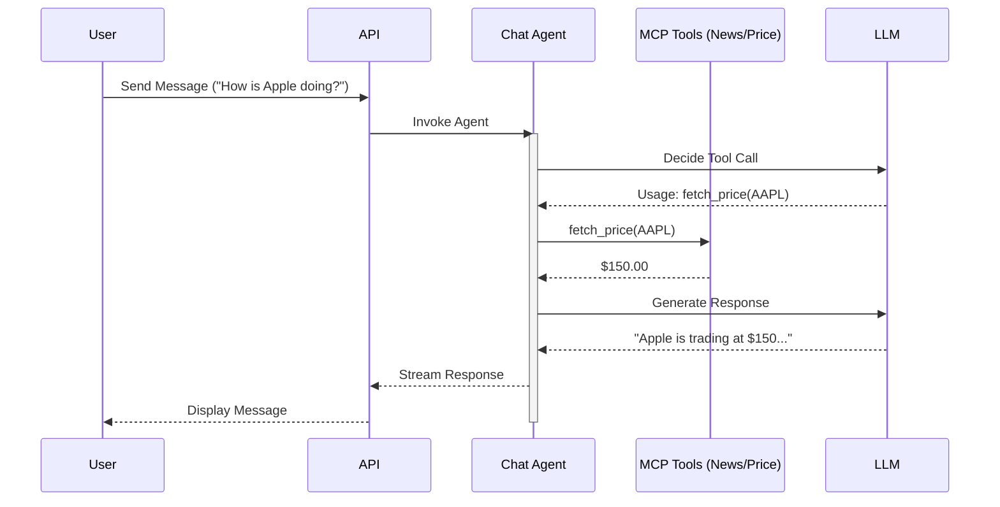

# AI Stock Investor - System Architecture

This document details the technical architecture, user flows, and agent workflows of the AI Stock Investor application.

## 1. System Architecture

The system follows a microservices-like architecture where a **Frontend** (React + Vite) communicates with a **Backend** (FastAPI). The Backend orchestrates a Multi-Agent System using **LangGraph** to analyze stocks and provide conversational insights.

```mermaid
graph TD
    subgraph "Frontend Layer (React + Vite)"
        UI[User Interface]
        Dash[Dashboard View]
        Scan[Scanner View]
        Goal[Goals View]
        ChatUI[Chat Widget]
        Router[React Router]
    end

    subgraph "Backend Layer (FastAPI)"
        API[API Gateway / Server]
        Models[Pydantic Models]
        DB_Conn[Database Handler]
    end

    subgraph "Agentic Layer (LangGraph)"
        Master[Master Agent]
        Analyst[Analyst Agent]
        Quant[Quant Agent]
        Risk[Risk Agent]
        ChatBot[Chat Agent]
    end

    subgraph "Data & Tools Layer"
        Mongo[(MongoDB)]
        Redis[(Redis Cache)]
        YF[YFinance Tool]
        News[News API Tool]
        LLM[LLM Service (OpenAI/Gemini)]
    end

    %% Connections
    UI --> Router
    Router --> Dash
    Router --> Scan
    Router --> Goal
    UI --> ChatUI

    Dash -->|HTTP Request| API
    Scan -->|HTTP Request| API
    ChatUI -->|HTTP Request| API

    API --> Master
    API --> ChatBot

    Master -->|Orchestrates| Analyst
    Master -->|Orchestrates| Quant
    Master -->|Orchestrates| Risk

    ChatBot -->|Calls| YF
    ChatBot -->|Calls| News
    ChatBot -->|Calls| LLM

    Analyst -->|Calls| News
    Analyst -->|Calls| LLM

    Quant -->|Calls| YF
    Quant -->|Calls| LLM

    Risk -->|Calls| LLM

    Master -->|Reads/Writes| DB_Conn
    ChatBot -->|Reads/Writes| DB_Conn
    DB_Conn --> Mongo
    DB_Conn --> Redis
```

## 2. User Flow

The following diagram illustrates how a user interacts with the application, including the new Chat functionality.



## 3. Agent Execution Workflow

### 3.1 Stock Analysis Workflow
The **Master Agent** utilizes a sequential graph to orchestrate the deep analysis process.



### 3.2 Chat Agent Workflow
The **Chat Agent** operates dynamically to answer user queries using available tools.



## 4. Key Components

### Frontend Components

- **Layout**: Main wrapper with Navigation bar.
- **Dashboard**: Entry point, displays the Search Bar and Analysis Results.
- **AnalysisCard**: Complex component to render charts, signals, and agent summaries.
- **ScannerPage**: For filtering market data (Technical Scans).
- **GoalsPage**: For managing user financial goals.
- **ChatWidget**: Floating chat interface utilizing React-Markdown for rich text responses.

### Backend Agents

- **Master Agent**: The controller. Defines the LangGraph workflow `Resolve -> Info -> Analyst -> Quant -> Risk -> Decision`.
- **Analyst Agent**: Scrapes news, analyzes sentiment using LLM, and identifies major events.
- **Quant Agent**: Fetches historical price data, calculates technical indicators (RSI, MACD, etc.), and generates trade signals.
- **Risk Agent**: Acts as a sanity check. Verifies if a trade aligns with risk parameters and calculates safe position sizes.
- **Chat Agent**: A conversational agent equipped with tools to answer market questions, summarize stocks, and explain concepts.

### Data Models

- **TradeSignal**: Represents a single actionable trade signal (Symbol, Signal, Entry, Stop Loss).
- **BacktestResult**: Detailed statistical result of a strategy backtest (Win Rate, PnL, Drawdown).
- **NewsArticle**: Structured news data with sentiment analysis.
- **PriceCandle**: OHLCV data point for charting.

## 5. Deployment Architecture

The application is deployed using a decoupled strategies for Frontend and Backend.

```mermaid
graph LR
    subgraph "Cloud Providers"
        Vercel[Vercel (Frontend Hosting)]
        Render[Render (Backend Hosting)]
    end

    subgraph "Infrastructure"
        Git[GitHub Repo]
        Docker[Docker Container]
    end

    Git -->|Push main| Vercel
    Git -->|Push main| Render

    Render -->|Builds| Docker
    Docker -->|Runs| FastAPI

    Vercel -->|Builds| ReactApp
```

- **Frontend**: Deployed on **Vercel** for global CDN distribution and automatic builds from the repository.
- **Backend**: Deployed on **Render** as a Web Service running a Docker container.
- **Database**: 
    - MongoDB: Hosted integration or external provider.
    - Redis: Hosted integration or external provider.

## 6. Testing Strategy

The system employs a comprehensive Unit Testing strategy using **pytest**.

- **Tools Layer**: Individual MCP tools (`stock_info`, `trend_detector`) are tested against mock data to verify logic without external API calls.
- **Agent Layer**: Agents (`Analyst`, `Quant`, `Master`) are tested by mocking sub-components and verifying orchestration flows and JSON outputs.
- **API Layer**: API endpoints are validated using `FastAPI TestClient` to ensure correct response schemas and error handling.
- **Continuous Integration**: Tests can be run locally via `pytest backend/tests` relative to the project root.
