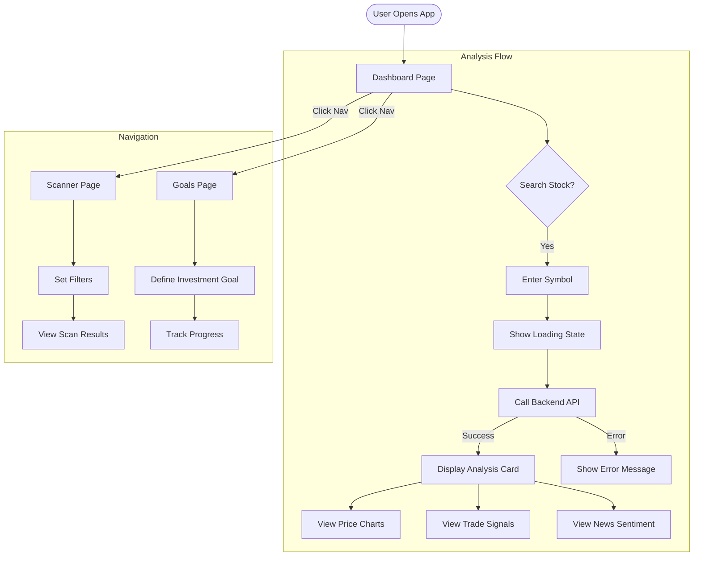
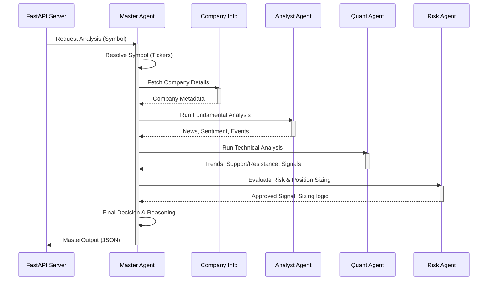

# AI Stock Investor - System Architecture

This document details the technical architecture, user flows, and agent workflows of the AI Stock Investor application.

## 1. System Architecture

The system follows a microservices-like architecture where a **Frontend** (React) communicates with a **Backend** (FastAPI). The Backend orchestrates a Multi-Agent System using **LangGraph** to analyze stocks.

```mermaid
graph TD
    subgraph "Frontend Layer (React + Vite)"
        UI[User Interface]
        Dash[Dashboard View]
        Scan[Scanner View]
        Goal[Goals View]
        Router[React Router]
    end

    subgraph "Backend Layer (FastAPI)"
        API[API Gateway / Server]
        Models[Pydantic Models]
        DB_Conn[Database Handler]
    end

    subgraph "Agentic Layer (LangGraph)"
        Master[Master Agent]
        Analyst[Analyst Agent]
        Quant[Quant Agent]
        Risk[Risk Agent]
    end

    subgraph "Data & Tools Layer"
        Mongo[(MongoDB)]
        Redis[(Redis Cache)]
        YF[YFinance Tool]
        News[News API Tool]
        LLM[LLM Service (OpenAI/Gemini)]
    end

    %% Connections
    UI --> Router
    Router --> Dash
    Router --> Scan
    Router --> Goal

    Dash -->|HTTP Request| API
    Scan -->|HTTP Request| API

    API --> Master

    Master -->|Orchestrates| Analyst
    Master -->|Orchestrates| Quant
    Master -->|Orchestrates| Risk

    Analyst -->|Calls| News
    Analyst -->|Calls| LLM

    Quant -->|Calls| YF
    Quant -->|Calls| LLM

    Risk -->|Calls| LLM

    Master -->|Reads/Writes| DB_Conn
    DB_Conn --> Mongo
    DB_Conn --> Redis
```

## 2. User Flow

The following diagram illustrates how a user interacts with the application to analyze a stock.



## 3. Agent Execution Workflow

The **Master Agent** utilizes a sequential graph to orchestrate the analysis process. This ensures that each step has the necessary context from the previous step.



## 4. Key Components

### Frontend Components

- **Layout**: Main wrapper with Navigation bar.
- **Dashboard**: Entry point, displays the Search Bar and Analysis Results.
- **AnalysisCard**: Complex component to render charts, signals, and agent summaries.
- **ScannerPage**: For filtering market data (in development).
- **GoalsPage**: For managing user financial goals (in development).

### Backend Agents

- **Master Agent**: The controller. Defines the LangGraph workflow `Resolve -> Info -> Analyst -> Quant -> Risk -> Decision`.
- **Analyst Agent**: Scrapes news, analyzes sentiment using LLM, and identifies major events.
- **Quant Agent**: Fetches historical price data, calculates technical indicators (RSI, MACD, etc.), and generates trade signals.
- **Risk Agent**: Acts as a sanity check. Verifies if a trade aligns with risk parameters and calculates safe position sizes.

### Data Models

- **TradeSignal**: Represents a Buy/Sell/Hold recommendation with confidence score.
- **NewsArticle**: Structured news data with sentiment analysis.
- **PriceCandle**: OHLCV data point for charting.
