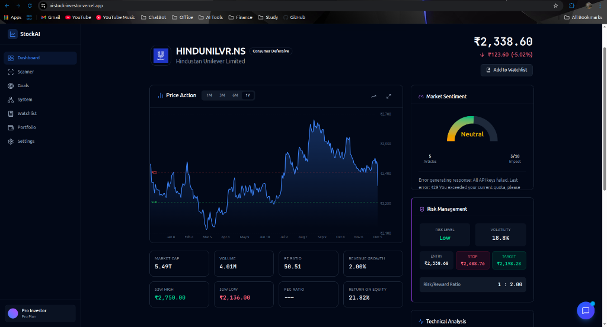

# NeoTrade



A trading cockpit for Indian equities and F&O. A strategy engine watches a universe of
instruments and emits **fully-formed trades** — size, entry reference, stop, target, the rule
codes that fired, and a composite score — then either executes them (intraday) or routes them
to an approval inbox (long-term). Each user connects their own broker account and chooses per
strategy whether it trades on paper or with real money.

The defining constraint: **the AI contribution to any trade's conviction is capped at 30% and
cannot rescue a trade the rules did not already support.** That cap is enforced in the type
system, not by convention.

## Documentation

| Question | Document |
|---|---|
| What is this product, who uses it, what states matter? | [`PRODUCT.md`](PRODUCT.md) |
| How does the code work, and where is it going? | [`docs/ARCHITECTURE.md`](docs/ARCHITECTURE.md) |
| What gets built next? | [`docs/ROADMAP.md`](docs/ROADMAP.md) |
| Visual system | [`DESIGN.md`](DESIGN.md) |

## Features

- **Rule strategy engine** — intraday and long-term strategies emitting scored, sized trade
  intents; new strategies plug into a registry.
- **Composite scoring with a hard AI ceiling** — rule conviction decides; the LLM can adjust
  within 30% and never below the rule floor.
- **Risk-aware sizing** — position size derived from account size, per-trade risk, and stop
  distance, with exposure limits; never computed inside a strategy.
- **Approval inbox** — long-term proposals wait for an explicit approve/reject and expire
  after three days; intraday proposals execute automatically.
- **Backtesting** — strategies replay through the same runner and execution simulator used
  live, with Indian transaction costs modelled.
- **Research and chat** — news/sentiment analysis and a tool-using assistant, both through a
  self-hosted OmniRoute LLM gateway.
- **Live market data** over WebSocket, with explicit live/stale/market-closed states.

## Tech stack

**Backend** — FastAPI (Python 3.11+), MongoDB (motor), Redis, pandas/numpy for the indicator
toolkit, yfinance and Zerodha Kite Connect for market data, LangChain/LangGraph for the
research and chat agents, pytest for tests.

**Frontend** — React 19 + Vite (plain JSX), Tailwind v4, React Router 7, recharts,
framer-motion, axios.

**Infrastructure** — Docker Compose on an Oracle Cloud VM behind Nginx + Let's Encrypt for the
backend; Vercel for the frontend. Both push-to-deploy from `main`.

## Setup

### Docker (recommended)

```bash
git clone https://github.com/kushgarg132/AI_Stock_Investor.git
cd AI_Stock_Investor
# create .env with the values below, then:
docker compose up -d --build backend
```

MongoDB and Redis are external (managed) services, not compose containers — point
`MONGODB_URL` and `REDIS_URL` at them. Also required: `GOOGLE_CLIENT_ID`, `JWT_SECRET`,
`CORS_ALLOWED_ORIGINS`, and `OMNIROUTE_API_KEY` + `OMNIROUTE_BASE_URL` for anything using the
LLM. `KITE_API_KEY`/`KITE_API_SECRET` are optional — the app treats an unconfigured broker as
a normal state, not an error.

The compose file also defines a `frontend` service for local development; production
frontend is Vercel, so don't start it on the deployment host.

### Manual

```bash
# backend (needs Mongo and Redis reachable)
cd backend
python -m venv .venv && source .venv/bin/activate
pip install -r requirements.txt
uvicorn server:app --reload --port 8001

# frontend
cd frontend
npm install
npm run dev
```

### Tests

```bash
cd backend && python -m pytest
```

## Project structure

```
backend/
├── strategies/      # rule strategies (intraday, longterm) + registry
├── scoring/         # composite score, AI cap, rule floor
├── engine/          # runner, sizing, portfolio, execution, backtest, persistence
├── suggestions/     # approval inbox: store, sink, scan, service
├── auth/            # Google sign-in, JWT, refresh tokens, Kite session
├── data/            # market data providers and feeds
├── components/      # analyst/chat agents, shared models, risk rules
├── research/        # LangGraph research agent
├── routers/         # FastAPI endpoints
└── tests/

frontend/src/
├── pages/           # Dashboard, Suggestions, Portfolio, Trading, Watchlist, Scanner, Settings
├── components/      # layout + UI
├── context/         # auth state
└── utils/           # axios instance, interceptors, endpoints
```

## API documentation

With the backend running: Swagger at `/api/v1/docs`, ReDoc at `/api/v1/redoc`.
