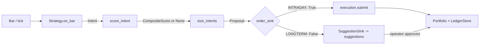
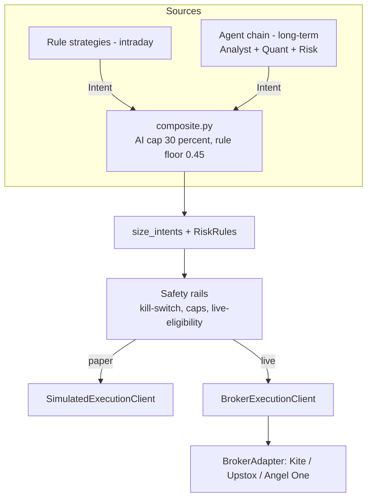

# NeoTrade — architecture

Three sections: **as-built** (what the code does today, with anchors), **target** (where it
is going), and **the delta** (which roadmap phase closes each gap). When as-built and the
code disagree, the code is right and this document is a bug — fix it in the same commit.

Companion documents: [`../PRODUCT.md`](../PRODUCT.md) for what the product is and who it
serves, [`ROADMAP.md`](ROADMAP.md) for the phase order and done-when criteria,
[`../DESIGN.md`](../DESIGN.md) for the visual system.

---

## 1. As-built

### 1.1 The decision pipeline

There is exactly one live path from market data to a trade. It does not involve the LLM
agent graph.

| Stage | Where | What it produces |
|---|---|---|
| Strategy | `backend/engine/protocols.py:37-42` (`Strategy` Protocol), `backend/strategies/base.py:30-56` | `Intent` |
| Scoring | `backend/scoring/composite.py:37-43` (`score_intent`) | `CompositeScore` or `None` |
| Sizing | `backend/engine/runner.py:50-143` (`size_intents`) | `Proposal` |
| Routing | `backend/engine/runner.py:183-262` (`run`), `backend/suggestions/sink.py:32-50` | order **or** suggestion |
| Fills | `backend/engine/execution/simulated.py:17-66` | `Fill` |
| Book | `backend/engine/portfolio.py:14-57`, `backend/engine/persistence.py` | positions, PnL, ledger |

`Intent` (`backend/core/models.py:48-69`) is deliberately thin: `symbol`, `side`,
`strength` (0–1), `reason_codes` (non-empty, enforced in the constructor), `stop_hint`,
`target_hint`. No entry price, no sizing, no timestamp — those are added downstream. This
thinness is what makes the scoring cap below possible, so treat it as load-bearing.

### 1.2 The invariants — do not break these silently

These implement `PRODUCT.md`'s claim of *legible machine conviction*. They are enforced in
code and covered by tests, not left to discipline.

- **AI is capped at 30% of conviction.** `AI_CAP = 0.30`
  (`backend/scoring/composite.py:15`). `CompositeScore.__post_init__`
  (`composite.py:25-30`) clamps `ai_weight` via `object.__setattr__` on a frozen dataclass,
  so a caller passing `0.99` still gets `0.30`. Tested in
  `backend/tests/test_composite_score.py:18-20`.
- **AI cannot rescue a trade the rules did not support.** `RULE_FLOOR = 0.45`
  (`composite.py:16`); `score_intent()` returns `None` outright when
  `intent.strength < RULE_FLOOR`, and `runner.py:96-97` skips the intent entirely. Tested
  arithmetically in `test_composite_score.py:11-15`.
- **Every intent must carry reasons.** `Intent.__post_init__` rejects empty `reason_codes`
  (`core/models.py:65-69`). A trade with no explanation cannot exist.
- **Every per-account record carries `user_id`.** See §1.4.

### 1.3 Risk and sizing

One shared module: `RiskRules` (`backend/components/risk/risk.py:85-121`) —
`calculate_position_size(account_size, risk_per_trade_percent, entry_price, stop_loss)` and
`check_exposure_limit(...)`.

It has exactly one production caller: `size_intents` (`backend/engine/runner.py:111,118`),
where risk per trade scales with conviction: `risk_pct = BASE_RISK_PCT * scored.final`
(`runner.py:110`). Position sizing lives downstream of the strategy, never inside it.

### 1.4 Auth and multi-tenancy

Multi-user is largely already built, contrary to what older docs implied.

| Piece | Where |
|---|---|
| Google ID-token verification (no redirect flow, no client secret) | `backend/auth/google.py:26-43` |
| `User` model — `id, google_sub, email, name, picture, created_at` | `backend/auth/models.py:7-13` |
| `users` collection, unique index on `google_sub` | `backend/auth/store.py:36,38-59` |
| Session JWT, 30-minute lifetime | `backend/auth/jwt.py:12-23`, `backend/configs/settings.py:50` |
| Refresh tokens — opaque, SHA-256 hashed, rotated, replay-detecting, httpOnly cookie scoped to `/api/v1/auth` | `backend/auth/refresh_store.py:73-98`, `backend/routers/auth.py:23-38` |
| `get_current_user` as a router-level dependency | `backend/auth/dependency.py:16-28`, applied in `backend/server.py:103-136` |
| WebSocket auth (token as query param — browsers can't set WS headers) | `backend/ws/routes.py:41-48` |

User-scoped collections: `paper_orders`, `paper_fills`, `paper_positions`, `paper_trades`
(`backend/engine/persistence.py:30-36`, `user_id` stamped on write and filtered on every
read), `suggestions` (`backend/suggestions/store.py`), `user_prefs` (`backend/prefs.py`),
`trading_runs` (`backend/runs.py`), `watchlist` (`backend/routers/watchlist.py`).

Correctly global (shared reference data, not personal): `instruments`, `instrument_meta`,
and the `sentiment:{symbol}` Redis cache.

### 1.5 Suggestions (the long-term approval inbox)

- Created by `SuggestionStore.create` (`backend/suggestions/store.py:31-70`), persisting the
  sized order plus the score breakdown `{rule, ai, final}` and publishing to the WS hub.
- Approved/rejected by `store.decide()` (`store.py:96-122`) using an atomic
  `find_one_and_update` gated on `status == PENDING` — double-approval is impossible by
  construction.
- Executed on approval by `backend/suggestions/service.py:19-45`, against a *fresh* mark
  price rather than the stale bar the engine last saw.
- Expire after 3 days (`DEFAULT_TTL`, `store.py:20`; `expire_stale`, `store.py:130-136`).
- Generated either by a live run (`POST /trading/start`) or by `scan_universe`
  (`backend/suggestions/scan.py:76-138`), which replays ~400 days of history through the
  same runner and only arms the sink on the final session (`_ArmOnFinalSession`,
  `scan.py:33-51`) so warmup intents never become suggestions.

### 1.6 Execution and backtest

`SimulatedExecutionClient` (`backend/engine/execution/simulated.py:17-66`) is the *only*
`ExecutionClient` implementation. It fills MARKET orders at the last-seen bar close and
applies Indian transaction costs (`backend/engine/execution/costs.py`). The same class
serves both backtest and paper trading.

`run_backtest` (`backend/engine/backtest.py:19-97`) wires `HistoricalFeed` + `SimClock` +
the simulated client through the *same* `runner.run()`, with no `order_sink`, so every
proposal executes. It returns `BacktestResult`
(`backend/components/shared/models.py:59-71`). Note: `max_drawdown` and `sharpe_ratio` are
hardcoded `0.0` (`backtest.py:94-95`) — they are not computed.

### 1.7 Data and live updates

- Market data behind `MarketDataProvider` (`backend/data/protocols.py:7-9`), implemented by
  `YFinanceProvider` and `KiteProvider`. This seam is already broker-agnostic for *data*.
- Feeds behind `DataFeed` (`backend/engine/protocols.py:45-46`): `HistoricalFeed`,
  `PollingLiveFeed`, and `KiteTickerFeed` (`backend/data/feeds/live_kite.py`, **not wired
  into any live path today**).
- One WebSocket, `GET /api/v1/ws` (`backend/ws/routes.py:60-86`), topic pub/sub through an
  in-process `Hub` (`backend/ws/hub.py:24-95`). A 15-second pump
  (`backend/ws/pump.py:22,26-53`) publishes marks and recomputed PnL; suggestion and run
  events are published reactively by their own stores.

### 1.8 Dead code (scheduled for revival, not deletion)

`QuantAgent` (`backend/components/quant/agent.py`), `RiskAgent`
(`backend/components/risk/agent.py`) and the legacy `backend/components/quant/strategies.py`
have **no production callers**. The LangGraph decision node was deliberately removed; what
survives is `ResearchAgent` (`backend/research/graph.py:58-159`), whose graph is
`resolve_query → company_info → analyst → synthesize → END` and which returns a narrative
`ResearchReport` with no BUY/SELL/HOLD, plus `AnalystAgent` and `ChatAgent`.

`RiskAgent` carries its own inert `confidence*0.6 + alignment*0.4` blend with a `0.25`
threshold (`components/risk/agent.py:95-99`) — a *different* formula from the enforced
30% cap. If the agents are revived (Phase 6), this formula must not come back with them;
the revived chain emits `Intent` and is scored by `composite.py` like everything else.

### 1.9 Known structural limits

| Limit | Where | Consequence |
|---|---|---|
| One broker session for the whole deployment | `backend/auth/kite_session.py:42,105-107` (fixed Redis key `kite:access_token`), `backend/routers/broker.py:9-13`, `backend/routers/trading.py:99-122` | Every signed-in user shares one Kite account |
| Broker credentials written to `.env` on disk and into the settings singleton, behind auth only | `backend/routers/settings.py:77-96,119-144` | **Any signed-in user overwrites everyone's credentials.** No admin/role concept exists |
| No real order placement anywhere | only `SimulatedExecutionClient`; `TRADING_LIVE_ENABLED` refuses to start (`routers/trading.py:164-168`) | Live trading is a from-scratch build |
| No backtest gate | nothing marks a strategy live-eligible; `backend/strategies/registry.py:16-59` is the only filter | A registered strategy trades immediately |
| Single-process state | `_RUNS` (`routers/trading.py:53`), `ws/hub.py:9-10`, `scheduler.py:8-10` | Breaks with more than one worker |
| `llm_service` module singleton | `backend/llm.py:125` | Per-user model choice (`omniroute_model` in `user_prefs`) is stored but never read |
| `/trading/start` trusts request-body risk caps | `routers/trading.py:158-215` vs `scheduler.py:52-59` which reads `PrefsStore` | The manual path can bypass a user's stored limits |

---

## 2. Target

### 2.1 Two engines, one contract

Intraday trades must fire on mechanical rules with no LLM in the loop; long-term ideas
genuinely need news and sentiment reasoning that rules do badly. So NeoTrade keeps two
idea sources, joined by a single contract rather than merged into one pipeline.

Both sources emit `Intent` and pass through the same scoring cap and the same `RiskRules`
sizing. Neither may size its own positions, and neither may invent its own conviction
formula — that is what made the old `RiskAgent` blend a liability.

### 2.2 Broker adapter layer

One `BrokerAdapter` protocol covering three concerns that today are tangled together:
credential and token lifecycle, market data, and order placement. Kite is ported onto it
first; Upstox and Angel One (SmartAPI) follow without further architecture change.

Every adapter instance is **per user**, constructed from that user's own stored
credentials — never from process-global settings. Token caches are keyed by user id.

### 2.3 Execution

A second `ExecutionClient` implementation over `BrokerAdapter`, alongside the simulated one.
Live execution needs what simulation does not: an order state machine (submitted →
acknowledged → partially filled → filled/rejected/cancelled), reconciliation against the
broker's own fill and position reports as the source of truth, and idempotent submission so
a retry cannot double-place. Paper versus live is a per-user, per-strategy setting.

### 2.4 Safety rails

Enforced in code, inside the sizing path, so no caller can route around them:

- **Daily loss kill-switch** — live trading halts for the rest of the session once
  realized + unrealized loss crosses the user's limit, and does not re-arm by itself.
- **Backtest gate** — a strategy is live-eligible only if a stored, dated backtest result
  meets the criteria in [`ROADMAP.md`](ROADMAP.md) Phase 3. Requires
  `max_drawdown`/`sharpe_ratio` to actually be computed, unlike today.
- **Per-trade and per-day capital caps**, read from the user's stored prefs rather than
  from the request body.

### 2.5 Instruments and F&O

The instrument model widens from equity symbols to `(symbol, exchange, instrument_type,
lot_size, expiry, strike, option_type)`. Sizing becomes lot-aware and margin-aware rather
than rupee-per-share, and positions gain expiry handling. Built in the same pass as live
execution.

### 2.6 Multi-worker

WS fan-out moves to Redis pub/sub, the scheduler takes a distributed lock, and running
engine loops move out of a process-local dict. Needed before real user load, not before
the first extra user.

---

## 3. The delta

| Gap (§1.9 / §1.8) | Closed by |
|---|---|
| Shared-credential write hole; no admin role | Phase 1 |
| One broker session per deployment | Phase 1, generalized in Phase 2 |
| Kite called directly throughout | Phase 2 |
| No kill-switch, no capital caps, no backtest gate; drawdown/Sharpe uncomputed | Phase 3 |
| Three intraday strategies unregistered | Phase 4 |
| No real order execution; equities-only instrument model | Phase 5 |
| Dead agent code; long-term ideas come from rule strategies only | Phase 6 |
| Single-process state; LLM singleton | Phase 7 |
